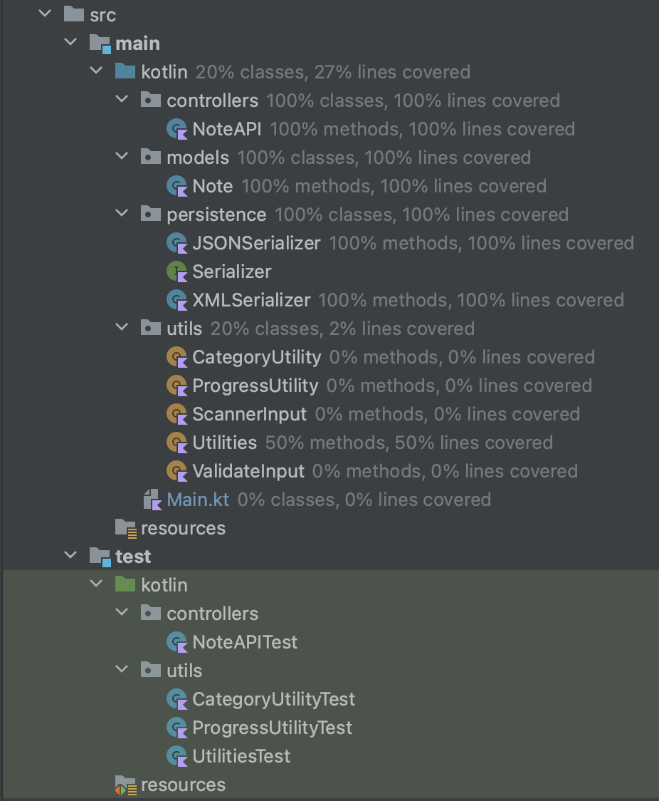
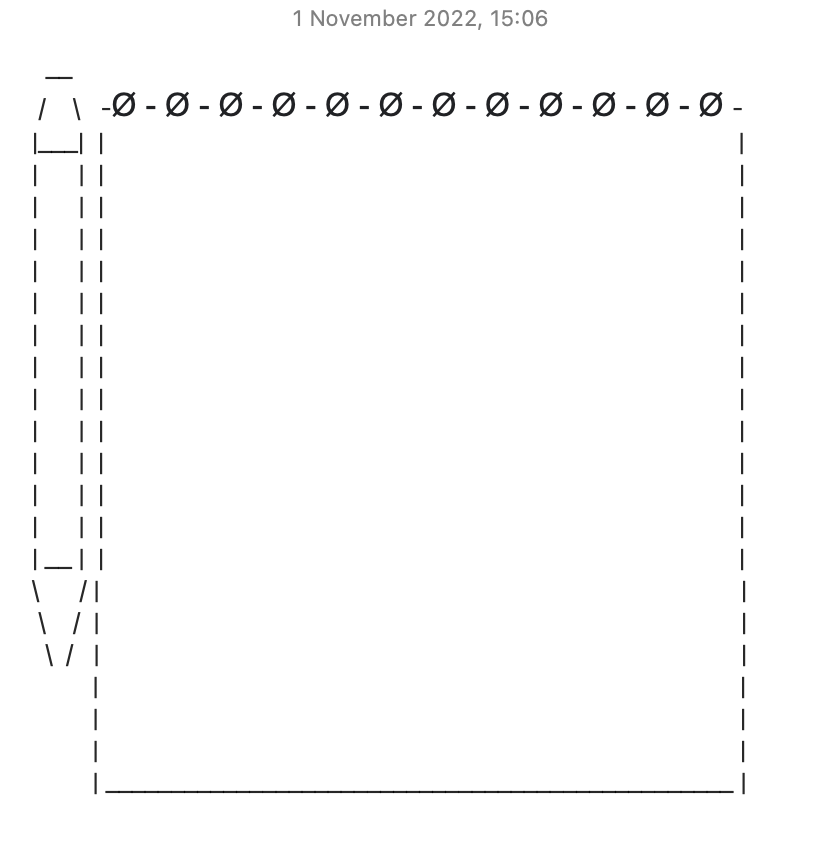
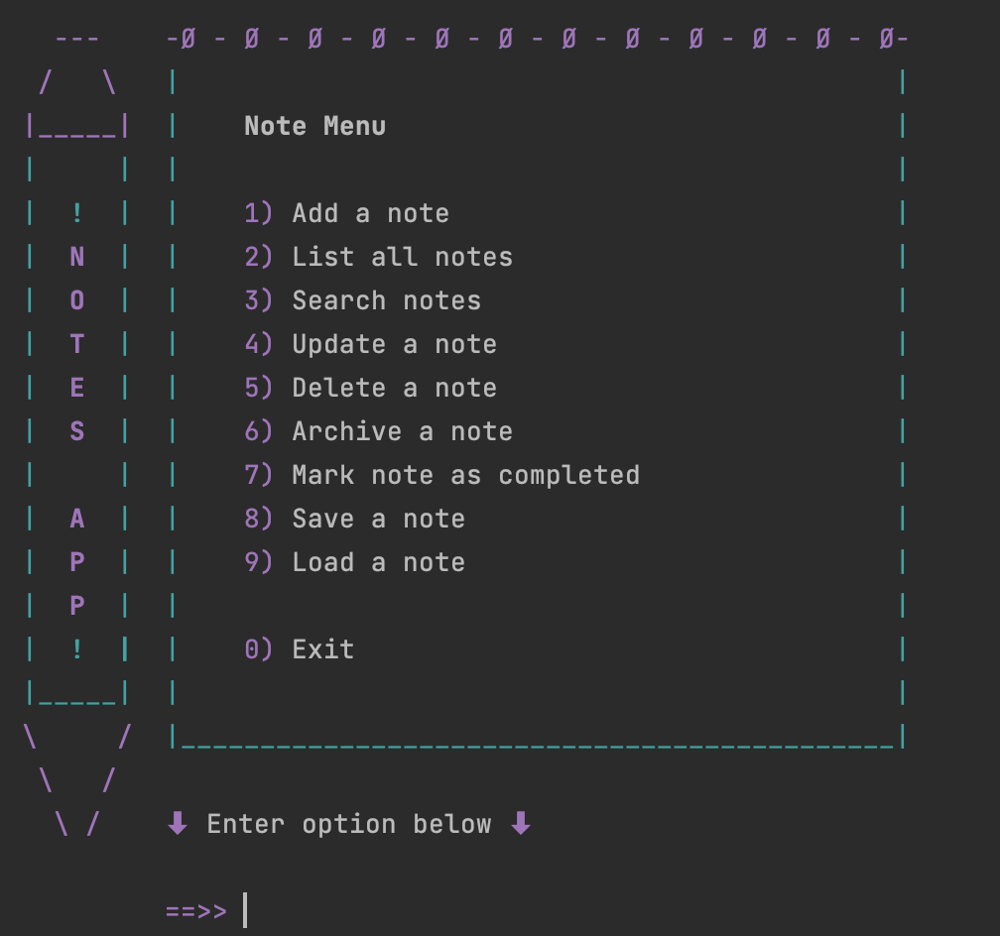
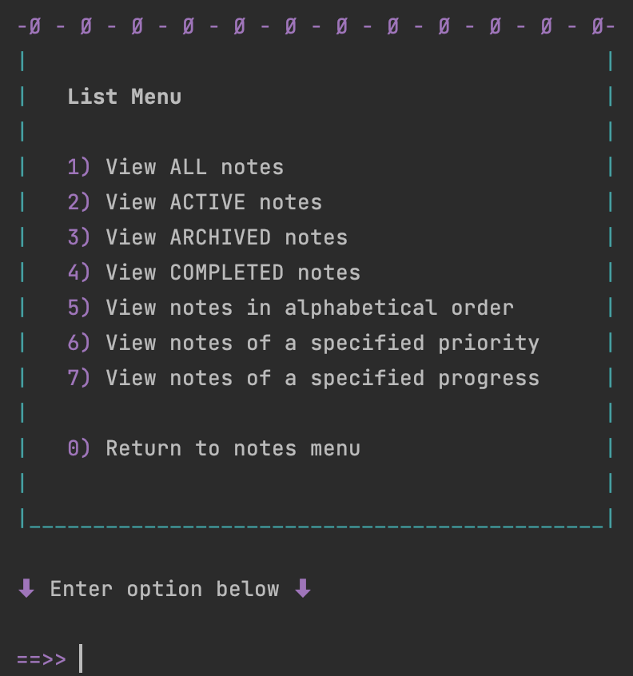
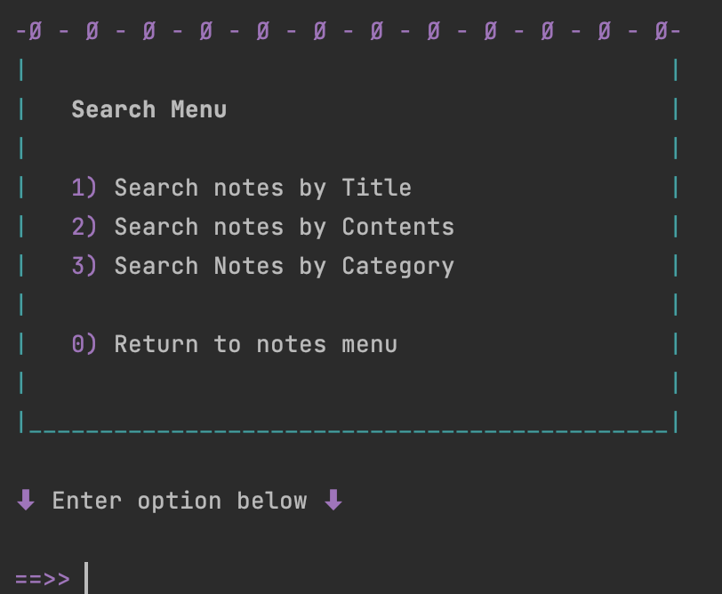
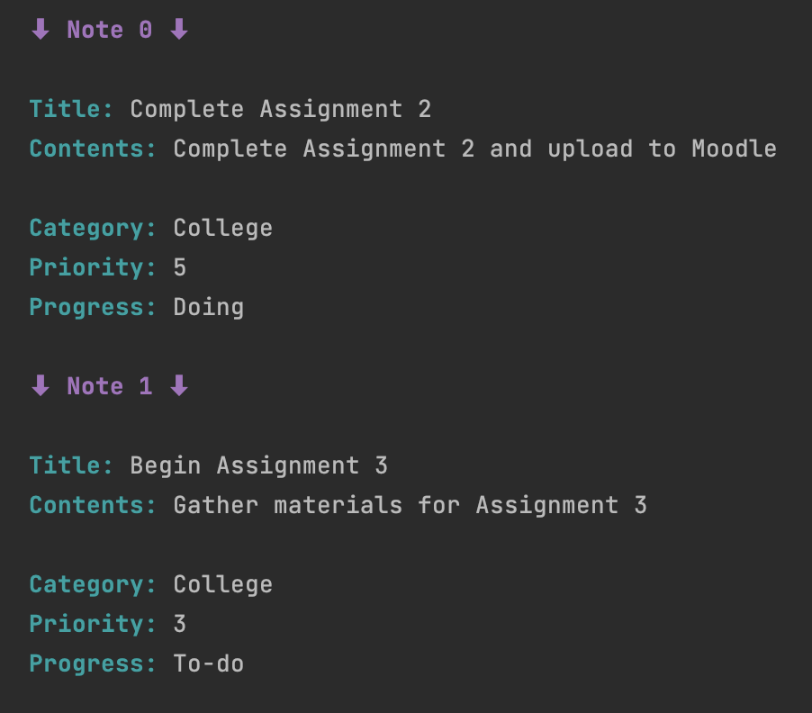

# Notes-App
Assignment 2 for Software Development Tools

## App Description
This is a console Note app written in Kotlin. 
Intellij was used to create and run this app and JUnit 5 was used for testing this app.

In this app, you are be able to do basic CRUD on notes as well as being able to archive notes, 
mark notes as complete and search for notes.

The app is discussed in more detail below.

## App Functionality

As part of the practical classes conducted from week 4 to week 7 of the college term,
I completed the assigned notes-app labs. 

**The work done within these labs include:**

_(The lab work was split into 3 different releases)_

### V1 additions

- Added a notes menu with options to list all notes, update a note, delete a note
  and exit app 

- Refactored the kotlin code of the notes menu to use other constructs

- Added a utility class to manage all console reads in order to stop the program 
  from crashing if the wrong data type is entered

- Added logging support

### V2 additions
- Added functionality to add a note

- Added functionality that lists all notes 

- Added functionality that lists all active notes 

- Added functionality that lists all archived notes

 
- Added JUnit tests for all of the above functionality

### V3 additions (final two labs combined together)
-  Added functionality to update a note

-  Added functionality to delete a note

-  Added dependencies to Gradle for XML and JSON persistence

-  Created a new persistence package and added a series of classes and interfaces to it

-  Updated the NoteAPI constructor to take a parameter indicating the serialization  
   type e.g. JSON, XML

-  Updated NoteAPI to use the new serialization classes and interfaces

-  Added functionality to archive a note

-  Added a list submenu that includes the listing functionalities

-  Added functionality to search for a note by title

-  Refactored numberOf and all list functions to use Lambdas

-  Refactored the joinString code so that it is in a helper function

-  Added JUnit tests for the applicable functionality above

For Assignment 2, the task was given to add on additional work that was not specified 
in the labs such as; additional listing and counting methods, incorporating new input fields, 
adding new utility classes in the utils folder for validation and adding 
the corresponding JUnit testing to the note-app.

**The additional work that I added as part of the assignment include:**

_(The additional assignment work was split into 2 different releases)_

### V4 additions
- Incorporated two new input fields to the note class (note contents and note progress 
  (To-do, doing, done))

- Added new utility classes in the utils folder for validation purposes

- Added functionality to mark a note as completed (this will automatically 
  change the progress to done)

- Added additional list methods (list completed notes, list notes in alphabetical 
  order of the titles, list notes by specified priority and list notes 
  by specified progress)

- Added additional count methods (numberOfCompletedNotes, numberOfNotesByProgress)

- Added a search submenu for that includes the searching functionalities

- Improved user interface of the app

- Included Gradle logging

- Added JUnit tests for the applicable functionality above

- Made minor code fixes to NoteAPI.kt and updated the 
  related JUnit tests to accommodate for these fixes

### V5 additions (final release)

**This release includes all of the above along with some final changes:**

- Made sure the code adheres to good coding practices e.g by making sure it is neat
- Any code that needed minor tweaks was edited 

## Package Structure

**I followed this package structure:**

## GitHub workflow

**The GitHub workflow used throughout the labs and assignment was:**

Issue - Branch - Commit(s) - Push - Pull Request - Merge - Close Issue - Delete Branch

## User Interface

As part of Assignment 2, I improved the UI of the notes-app. 

For the note menu, I created a pen and notepad design
that I first drafted up on my laptops 'Notes' application,
using symbols and characters on my keyboard like so:

I then copied the design into Intellij where I added the note menu 
options into the note pad design and added "!Notes App!" 
text into the pen design like so:

For both the list menu and search sub menus, I removed the pen design 
but continued to use the notepad design and then added the menu options into
the notepad design like so:

When the notes are listed they display like so:

Cyan, magenta and white were the colours used throughout the three menus 
and listing of notes.

## References

* To help me add colour to the console output (to improve the UX/UI of my app) I used: https://www.lihaoyi.com/post/BuildyourownCommandLinewithANSIescapecodes.html

* For the utility classes in the utils folder, 
  I used the code resource links under the heading "More Additional Functionality"
  from: https://reader.tutors.dev/#/lab/sdt-sept-2022.netlify.app/topic-07-lambdas/unit-02-labs/book-01/Assignment2

I also referenced these links throughout the code in comments over the related functions.